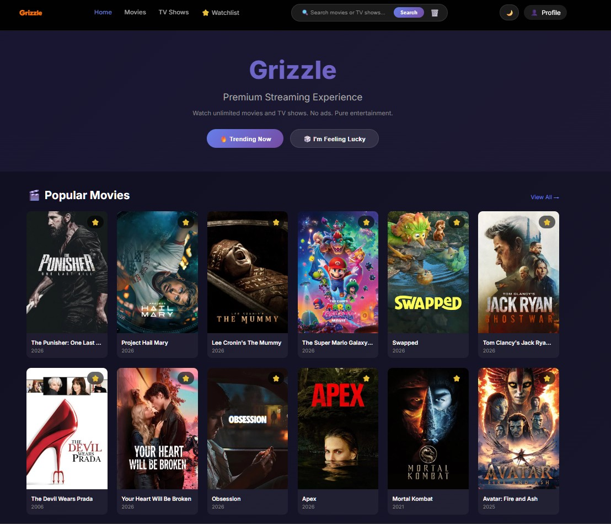
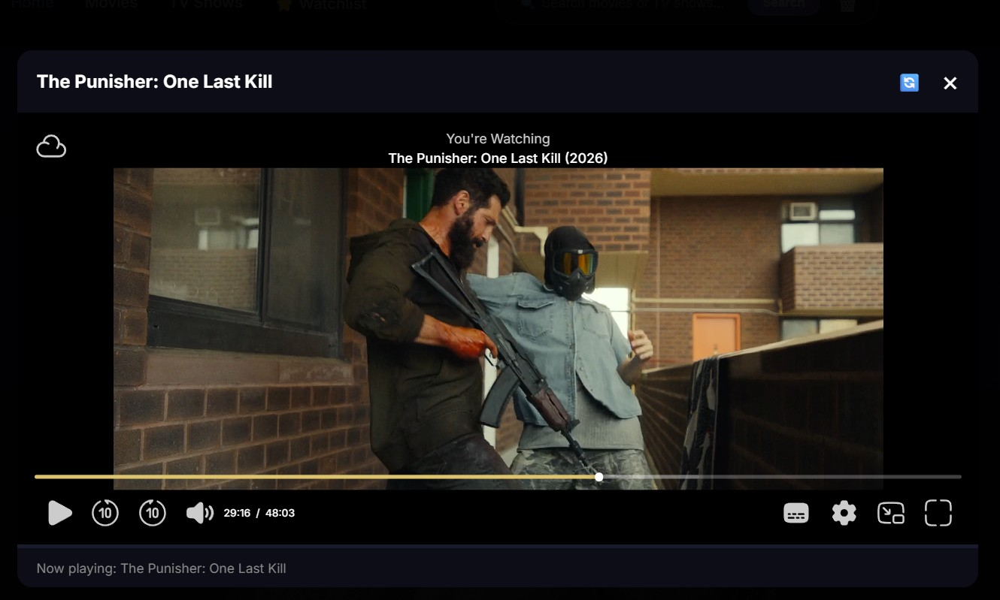

<div align="center">
  
  <h1>🎬 Grizzle</h1>
  <p><strong>Personal Streaming Platform – Your Own Netflix, Self-Hosted</strong></p>
  
  <p>
    
    
    
    
  </p>
  
  <p>
    
    
    
    
  </p>
</div>

---

## ✨ Features

| Feature | Description |
|---------|-------------|
| 🎬 **Movies & TV Shows** | Browse popular movies and TV series from TMDB |
| 🔍 **Smart Search** | Autocomplete search with persistent history (localStorage) |
| ⭐ **Watchlist** | Save your favorite content for later |
| 🌓 **Dark/Light Mode** | Toggle between themes, remembers your preference |
| 📱 **PWA Ready** | Install as native app on mobile/desktop |
| 📺 **TV Series Support** | Season selector + episode list directly on detail page |
| 🔄 **Player Refresh** | Built-in refresh button for embed issues |
| 📊 **TMDB Code Scraper** | Analyze watchlist IDs, export CSV/JSON |
| 🔐 **Secure** | Works over Tailscale/ZeroTier for remote access |

---

## 🖼️ Screenshots

<div align="center">
  <table>
    <tr>
      <td align="center">
        
        <br />
        <em>🏠 Home Page - Browse Movies & TV Shows</em>
      </td>
      <td align="center">
        
        <br />
        <em>🎬 Movie Detail - Watch & add to watchlist</em>
      </td>
    </tr>
  </table>
</div>

---


## 🚀 Quick Start

### Prerequisites

- **Nginx** (or any static web server)
- **API Key** from [TMDB](https://www.themoviedb.org/signup) (free)

### Installation

#### 1. Clone the Repository

```bash
git clone https://github.com/b70386/grizzle.git
cd grizzle
```

#### 2. Configure Nginx

Copy `nginx.conf.example` to your Nginx `conf/` folder and update the path.

#### 3. Start Nginx

```bash
nginx.exe
```

#### 4. Access Grizzle

Open your browser and navigate to:

```
http://localhost:4555
```

#### 5. Remote Access (Optional)

Using [Tailscale](https://tailscale.com):

```
http://[your-tailscale-ip]:4555
```

---

## 🛠️ Configuration

### TMDB API Key

Edit `js/app.js` and replace the API key:

```javascript
const TMDB_API_KEY = 'your_api_key_here';
```

### Embed Domains

Grizzle supports multiple embed sources. Configure in `js/app.js`:

```javascript
const EMBED_DOMAINS = [
    'https://vidfast.pro',
    'https://vidsrc-embed.ru',
    'https://vidsrc-embed.su',
    'https://vsembed.ru'
];
```

---

## 📁 Project Structure

```
grizzle/
├── index.html						# Main entry point
├── manifest.json				# PWA manifest
├── sw.js								# Service Worker
├── favicon.png					# Browser favicon
├── icon.png						# App icon
├── screenshots/
│   └── home-page.png
     └── movie-detail.png
├── css/
│   └── style.css            		# Styles (dark/light mode)
├── js/
│   └── app.js               		# Main application logic
├── images/							# Optional assets
├── nginx.conf.example		# Nginx configuration reference
└── README.md					# This file
```

---

## 🎯 Roadmap

- [x] Basic streaming functionality
- [x] Search with autocomplete
- [x] Watchlist with localStorage
- [x] Dark/Light mode
- [x] PWA support
- [x] TV series episode selector
- [x] TMDB code scraper
- [ ] User accounts (optional)
- [ ] Download manager
- [ ] Subtitle download
- [ ] Trailer integration

---

## 🤝 Contributing

Contributions are welcome! Feel free to:

1. Fork the repository
2. Create a feature branch (`git checkout -b feature/amazing`)
3. Commit your changes (`git commit -m 'Add amazing feature'`)
4. Push to the branch (`git push origin feature/amazing`)
5. Open a Pull Request

---

## 📝 License

This project is licensed under the **MIT License** – see the [LICENSE](LICENSE) file for details.

---

## ⚠️ Disclaimer

> **For Personal Use Only**  
> Grizzle aggregates content from publicly available third-party sources.  
> It does **not host or store** any copyrighted content.  
> Users are responsible for complying with local laws and terms of service of the content providers.

---

## 🙏 Acknowledgments

- [TMDB](https://www.themoviedb.org) – Movie database API
- [VidFast](https://vidfast.pro) – Video embedding service
- [Vidsrc](https://vidsrc.me) – Alternative embed source
- [Google Fonts](https://fonts.google.com) – Inter font family

---

<div align="center">
  <p>Made with ❤️ for personal streaming</p>
  <p>
    <a href="https://github.com/b70386/grizzle/issues">Report Bug</a> •
    <a href="https://github.com/b70386/grizzle/issues">Request Feature</a>
  </p>
</div>